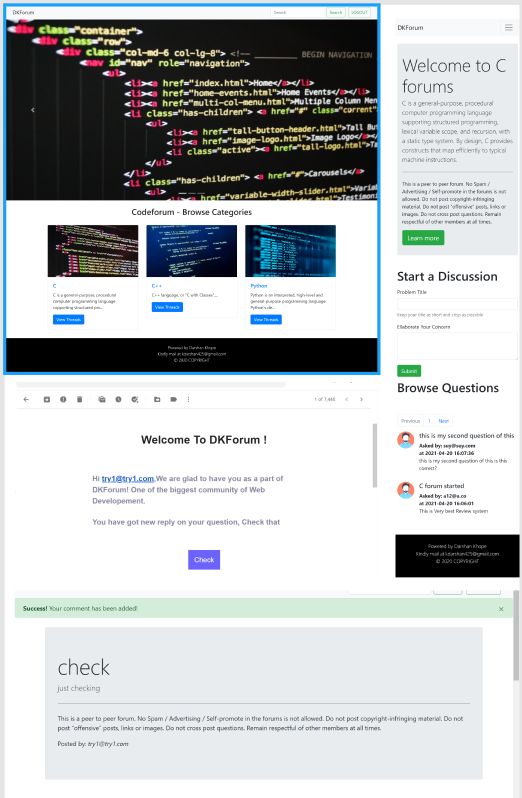

<h1 align="center">Hi 👋, This is 'DKForum' Website</h1>
<h2 align="center">Fullstack website for Coding forum.</h2> 
<h2>Live URL : <a href="https://dkforum.herokuapp.com/">https://dkforum.herokuapp.com/</a></h2>
<h2>features</h2>
<ol>
<li>Real time chat feature.</li>
<li>Search threads available.</li>
<li>Getting mails for New Submissions.</li>
<li>Pagination system after every 10 queries</li>
<li>Complete responsive website.</li>
<li>Security like hashing password, etc..</li>
<li>On page SEO </li>
</ol>
 
<h2>Languages Used</h2>
<ol>
<li>PHP</li>
<li>MySQL</li>
<li>HTML</li>
<li>CSS</li>
<li>JS</li>
<li>Bootstrap</li>
</ol>
<h2>Uses</h2>
<ol>
<li>Used as forum website</li>
<li>Doubt solver system in college</li>
<li>Review system in E-commerce stores</li>
</ol>
<h2>Some screen shots<h2>
  
  <h4>View Recording below,  
  
https://www.linkedin.com/posts/darshan-khope-9400571a2_webdevelopment-fullstack-html-ugcPost-6790338117455896576-XDHt
